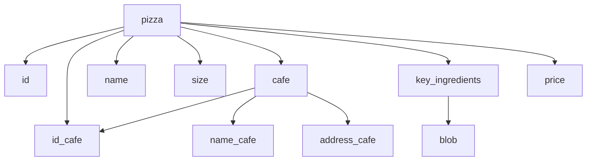

Add logs
https://raw.githubusercontent.com/2Alex20/Nazarov-java-pizzaproject/main/mvn_package_log.txt
https://raw.githubusercontent.com/2Alex20/Nazarov-java-pizzaproject/main/spring-boot_run_log.txt

video demo https://raw.githubusercontent.com/2Alex20/Nazarov-java-pizzaproject/main/nazarov_demo.mp4
https://raw.githubusercontent.com/2Alex20/Nazarov-java-pizzaproject/main/nazarov_demo.gif

---

Пофиксил ошибки в action после перехода на java 18, билды снова заработали !!!

---

Started WEB service with ./mvnw spring-boot:run
Checked with "wget -qO- http://localhost:8080/hello?name=Test123" which return: ```Hello Test123!```

------

Generated [spring](https://start.spring.io/#!type=maven-project&language=java&platformVersion=2.7.16&packaging=jar&jvmVersion=17&groupId=com.example&artifactId=spring4nazarov&name=spring4nazarov&description=Cafe%20backend&packageName=com.example.spring4nazarov&dependencies=web)

Указал нужные версии из требования к заданию, но ошибся и вместо 11й Явы, указал 17ю. Получил ошибки:
```
[INFO] BUILD FAILURE
[INFO] ------------------------------------------------------------------------
[INFO] Total time:  24.474 s
[INFO] Finished at: 2023-10-13T18:57:28Z
[INFO] ------------------------------------------------------------------------
[ERROR] Failed to execute goal org.apache.maven.plugins:maven-compiler-plugin:3.10.1:compile (default-compile) on project spring4nazarov: Fatal error compiling: error: invalid target release: 17 -> [Help 1]
```
которые исправил заменив значение java.version в pom.xml
После этого билд успешен:
```
docker run -it --name nazarov-maven -v "$(pwd)":/usr/src/mymaven -w /usr/src/mymaven maven:3.8-jdk-11 mvn clean install
...
[INFO] BUILD SUCCESS
[INFO] ------------------------------------------------------------------------
[INFO] Total time:  46.108 s
[INFO] Finished at: 2023-10-13T19:02:08Z
[INFO] ------------------------------------------------------------------------
```

14/10 добавлены задачи

- [x] https://github.com/2Alex20/Nazarov-java-pizzaproject/issues/11
- [ ] https://github.com/2Alex20/Nazarov-java-pizzaproject/issues/4
- [x] Update README.md


13/10 добавлено описани [REST API wiki](../../wiki/REST-API-details)

---

Database scheeme:



---

Pizza Project Functionality
The pizza project functionality would include the ability to create, read, update, and delete (CRUD) records for both pizzas and cafes. 
Pizza CRUD: create new pizza records by providing information such as the pizza's name, size, key_ingredients, cafe_id. They would also be able to view, update, and delete existing pizza records.
Cafe CRUD:  create new cafe records by providing information such as the cafe's name, location, and phone. They would also be able to view, update, and delete existing cafe records.

The application would also have the ability to retrieve all pizzas, retrieve a specific pizza, retrieve all cafes, retrieve a specific cafe and so on(all of the functions you can find here->https://docs.google.com/document/d/1d634J1H5YcM2TPcX8iCWfT5-SL1RmdlUt3hV3Xrp-F4/edit?usp=sharing)
Cafe to Pizza has bidirectional @OneToMany relationship. This means that one cafe can have multiple pizzas, but each pizza can only belong to one cafe.

